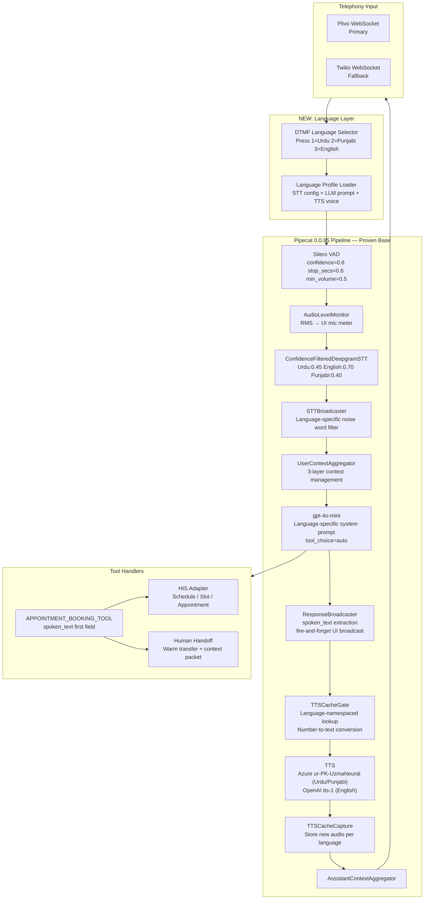

# Phase 1 — Legacy System Triage Output
**Agent**: Architecture Agent
**QA**: QA Agent
**Date**: 2026-04-24
**Status**: PASS

---

## 1. MODULE-BY-MODULE REUSE/DISCARD TABLE

| Module | File(s) | Decision | Reason |
|--------|---------|----------|--------|
| **Voice Pipeline Core** | `conversation_agent.py` (3,943 lines) | EXTRACT + ADAPT | Monolithic file — extract individual classes, discard triage-specific logic |
| **ConfidenceFilteredDeepgramSTT** | `conversation_agent.py:944` | REUSE AS-IS | Proven Urdu confidence threshold (0.45). Needs language-code parameter added for multi-language support |
| **TTSAudioCache** | `conversation_agent.py:1089` | REUSE AS-IS | Production-ready disk-backed LRU with orphan cleanup and per-language subdirs. Already has `language` param |
| **TTSCacheGate** | `conversation_agent.py:1278` | REUSE + EXTEND | Core caching gate — works. Extend to support language-namespaced cache lookups |
| **TTSCacheCapture** | `conversation_agent.py:1412` | REUSE + EXTEND | Works. Add language tag to capture call |
| **TTSProxy** | `conversation_agent.py:1025` | REUSE AS-IS | Hot-swap TTS provider without pipeline rebuild — directly useful for language-switching |
| **AudioLevelMonitor** | `conversation_agent.py:1931` | REUSE AS-IS | Language-agnostic RMS meter. Zero changes needed |
| **STTBroadcaster** | `conversation_agent.py:1966` | REUSE + EXTEND | Noise word filter works. Extend to load language-specific filler word lists from language profile |
| **ResponseBroadcaster** | `conversation_agent.py:2037` | ADAPT | Triage-specific spoken_text extraction pattern reusable. Remove triage scoring hooks, add receptionist intent hooks |
| **_numbers_to_urdu_words** | `conversation_agent.py:1272` | REUSE AS-IS | Complete Urdu number converter (0–999). Add Punjabi number converter alongside it |
| **_number_to_urdu** | `conversation_agent.py:1251` | REUSE AS-IS | Core integer-to-Urdu-words function |
| **_normalize_for_cache** | `conversation_agent.py:1074` | REUSE AS-IS | Language-agnostic text normalizer for cache keys |
| **_make_cache_key** | `conversation_agent.py:1082` | REUSE AS-IS | SHA-256 cache key — already includes language param |
| **_fire_and_forget** | `conversation_agent.py:1545` | REUSE AS-IS | Critical non-blocking broadcast helper — all UI events must use this |
| **InferenceLogger** | `conversation_agent.py:1556` | REUSE + EXTEND | Per-turn inference logging pattern. Extend with session_id, language, and receptionist-specific fields |
| **MetricsCollector** | `conversation_agent.py:1889` | REUSE + EXTEND | Per-stage latency tracking (STT/LLM/TTS). Extend with receptionist-specific KPIs |
| **_load_session / _save_session** | `conversation_agent.py:148,159` | DISCARD | JSON file-based persistence — replace with PostgreSQL + SQLAlchemy |
| **SessionManager + CallSession** | `telephony/session_manager.py:31,69` | REUSE + EXTEND | Proven multi-transport session tracking. Add `language_profile` field to CallSession. Add Plivo transport type |
| **TwilioService** | `telephony/twilio_service.py` | REUSE | Keep as fallback transport. Plivo becomes primary |
| **Daily.co Service** | `telephony/daily_service.py` | DISCARD | Not needed for hospital deployment. Plivo + direct WebSocket replaces it |
| **Triage Scoring Engine** | `conversation_agent.py:214` (`compute_cluster_scores`) | DISCARD | Clinical triage scoring — completely irrelevant to receptionist booking |
| **disease_clusters.json** | `disease_clusters.json` | DISCARD | Medical diagnosis database — not used by a receptionist. Replace with doctors/schedules DB |
| **_load_disease_clusters** | `conversation_agent.py:175` | DISCARD | Triage-specific loader |
| **_build_vitals_table** | `conversation_agent.py:381` | DISCARD | Clinical vitals — not relevant |
| **_build_symptom_doctor_mapping** | `conversation_agent.py:434` | DISCARD | Symptom-to-doctor routing — replace with specialty/availability-based routing |
| **_build_referral_rules** | `conversation_agent.py:452` | DISCARD | Clinical referral rules |
| **get_doctors_panel_text** | `conversation_agent.py:536` | DISCARD | Triage scoring display output |
| **_build_hospital_prompt** | `conversation_agent.py:660` | DISCARD | Triage-specific system prompt builder — rebuild for receptionist persona |
| **build_system_prompt** | `conversation_agent.py:910` | DISCARD | Triage-specific. Rebuild for receptionist with 3-language variants |
| **PATIENT_SCREENING_TOOL** | `conversation_agent.py:988` | DISCARD | Triage-specific tool schema — rebuild as APPOINTMENT_BOOKING_TOOL |
| **ConversationAgent class** | `conversation_agent.py:2286` | ADAPT | Large orchestration class. Keep pipeline wiring pattern, discard all triage state |
| **FastAPI lifespan + routes** | `conversation_agent.py:3512–3931` | ADAPT | Route pattern reusable. Discard triage-specific endpoints, add receptionist API routes |
| **Test suite** | `test_disease_clusters.py`, `test_system_performance.py` | ADAPT | Test patterns excellent. Discard triage-specific test cases, reuse framework and helper patterns |
| **Frontend HTML** | `templates/conversation_agent.html` | ADAPT | UI patterns (live transcription, WebSocket updates, RTL rendering, mic meter) reusable. Full visual redesign needed |
| **Urdu RTL UI** | `templates/conversation_agent.html` | REUSE | Noto Nastaliq font integration, `dir="rtl"`, line-height rules proven working |
| **Benchmark scripts** | `benchmark_stt.py`, `benchmark_tts_stt.py` | KEEP | Run before provider selection to validate Deepgram/Groq/Azure performance |
| **ICE_SERVERS config** | `conversation_agent.py:966` | REUSE | STUN/TURN config needed if WebRTC added |
| **FlushFileHandler** | `conversation_agent.py:89` | REUSE AS-IS | Force-flushed file logging — use in all log handlers |

---

## 2. REUSABLE UTILITIES — EXACT REFERENCES

| Utility | Source | Target | Notes |
|---------|--------|--------|-------|
| `ConfidenceFilteredDeepgramSTT` | `conversation_agent.py:944–963` | `providers/stt/deepgram.py` | Add `language_code` + per-language threshold dict |
| `TTSAudioCache` | `conversation_agent.py:1089–1226` | `providers/tts/cache.py` | Already language-namespaced. Use as-is |
| `_normalize_for_cache` | `conversation_agent.py:1074–1079` | `providers/tts/cache.py` | No changes needed |
| `_make_cache_key` | `conversation_agent.py:1082–1086` | `providers/tts/cache.py` | No changes needed |
| `TTSCacheGate` | `conversation_agent.py:1278–1411` | `pipeline/cache_gate.py` | Extend with language param |
| `TTSCacheCapture` | `conversation_agent.py:1412–1491` | `pipeline/cache_gate.py` | Extend with language param |
| `TTSProxy` | `conversation_agent.py:1025–1073` | `pipeline/tts_proxy.py` | Use for runtime language/provider switching |
| `AudioLevelMonitor` | `conversation_agent.py:1931–1965` | `pipeline/monitors.py` | Copy as-is |
| `STTBroadcaster` | `conversation_agent.py:1966–2036` | `pipeline/broadcasters.py` | Add language-aware noise_words loading |
| `ResponseBroadcaster` | `conversation_agent.py:2037–2285` | `pipeline/broadcasters.py` | Strip triage hooks, keep spoken_text extraction pattern |
| `_fire_and_forget` | `conversation_agent.py:1545–1554` | `core/utils.py` | Critical — must be used for all WebSocket broadcasts |
| `MetricsCollector` | `conversation_agent.py:1889–1930` | `pipeline/monitors.py` | Extend with receptionist KPIs |
| `InferenceLogger` | `conversation_agent.py:1556–1888` | `core/logging.py` | Extend with session_id + language fields |
| `_number_to_urdu` | `conversation_agent.py:1251–1269` | `core/localization.py` | No changes needed |
| `_numbers_to_urdu_words` | `conversation_agent.py:1272–1277` | `core/localization.py` | No changes needed. Add Punjabi equivalent |
| `_URDU_ONES dict` | `conversation_agent.py:1238–1249` | `core/localization.py` | Complete 0–90 + hundreds in Urdu |
| `FlushFileHandler` | `conversation_agent.py:89–113` | `core/logging.py` | Copy as-is |
| `SessionManager` | `telephony/session_manager.py:69` | `telephony/session_manager.py` | Add `language_profile` + Plivo transport type |
| `CallSession` dataclass | `telephony/session_manager.py:31` | `telephony/session_manager.py` | Add `language_profile: str` field |
| `build_stream_twiml` | `telephony/twilio_service.py:27` | `telephony/twilio.py` | Keep for Twilio fallback |
| `validate_phone_number` | `telephony/twilio_service.py:69` | `telephony/utils.py` | Pakistani +92 number validation |

---

## 3. PROVEN PIPELINE ARCHITECTURE (Mermaid)

Base pipeline proven in triage system — receptionist extends it, does not replace it.



---

## 4. COMPLETE ANTI-PATTERN LIST

### Audio Processing Filters — ALL BANNED
| Anti-Pattern | Failure | Evidence |
|-------------|---------|----------|
| `NoisereduceFilter` | OMP library conflict → audio distortion | `conversation_agent.py`, CLAUDE_TRACKER.md |
| `FacebookDenoiserFilter` | Crashes pipeline — BaseAudioFilter incompatibility with pipecat 0.0.85 | CLAUDE_TRACKER.md |
| `KrispFilter` | Requires paid SDK license — not installable | CLAUDE_TRACKER.md |
| `AICFilter` | Requires paid API license | CLAUDE_TRACKER.md |

**Correct approach**: VAD (energy gate) + STT confidence threshold + noise word text filter. No audio processing.

### Pipecat API Misuse
| Anti-Pattern | Failure |
|-------------|---------|
| `allow_interruptions=False` | Buffers audio during bot speech → double-transcription flooding on next turn |
| `ElevenLabsTTSParams` class | Does not exist in pipecat 0.0.85 → `ImportError` on startup |
| `eleven_v3` ElevenLabs model | HTTP 403 from ElevenLabs WebSocket — not supported in pipecat 0.0.85 WS mode |
| Upgrading pipecat past 0.0.85 | Breaking API changes in frame types and processor interfaces |
| Awaiting UI broadcasts in hot path | Blocks async event loop → measurable pipeline lag |

### STT / Language Configuration
| Anti-Pattern | Failure |
|-------------|---------|
| STT confidence > 0.70 for Urdu | Drops 30–50% of valid Pakistani Urdu speech (0.5–0.7 is normal) |
| VAD `confidence=0.80` for Urdu | Too strict — drops valid speech at sentence boundaries |
| No Urdu filler word filter | `آہ`, `ہاں`, `اچھا`, `جی`, `ٹھیک ہے` create false turn triggers |
| Locale code `ur-IN` instead of `ur-PK` | Wrong vocabulary, wrong pronunciation — Indian Urdu |
| Azure STT / Google STT for Punjabi | Only `pa-IN` (Gurmukhi) supported — useless for Pakistani Shahmukhi Punjabi |
| ElevenLabs free tier from Pakistan IPs | Geo-blocked — Creator key (`sk_4...`) required |

### Alias System
| Anti-Pattern | Failure |
|-------------|---------|
| Multi-word alias for single-word condition | `"persistent cough"` as alias of `"cough"` → cross-contamination, inflates unrelated scores |
| `"fatigue"` as alias of `"weakness"` | Inflates 4 unrelated departments |
| Single global alias list for all languages | Cross-language collisions — maintain separate lists per language |

### Architecture
| Anti-Pattern | Failure |
|-------------|---------|
| Synchronous DB/file writes in async pipeline | Blocks event loop → 50–300ms added per turn |
| `tool_choice="required"` | Forces tool overhead on every turn including simple greetings → 300–700ms wasted |
| Monolithic agent file | Impossible to test components in isolation — proven painful in triage system |
| JSON file session persistence | Race conditions on concurrent calls, not horizontally scalable |

---

## 5. LANGUAGE SUPPORT ASSESSMENT

### What Exists in Triage System
| Capability | Urdu (ur-PK) | English | Punjabi (pa-PK) |
|-----------|-------------|---------|----------------|
| STT provider configured | ✅ Deepgram (proven, 0.45) | ✅ Deepgram en-US | ⚠️ OpenAI Whisper only (slow HTTP, not Groq) |
| TTS provider | ⚠️ OpenAI tts-1 (not Azure ur-PK) | ✅ OpenAI tts-1 | ❌ None |
| Noise word filter | ✅ Urdu fillers present | ✅ English fillers | ❌ No Punjabi filler list |
| Number conversion | ✅ Complete 0–999 | ❌ Not built | ❌ Not built |
| System prompt | ✅ Full Urdu persona | ✅ Full English persona | ❌ No Punjabi prompt |
| 173+ alias system | ✅ Urdu + Roman Urdu + English | ✅ English | ❌ No Punjabi aliases |
| RTL rendering in UI | ✅ Working (Noto Nastaliq) | N/A | ❌ Not tested |
| DTMF language selection | ❌ Not implemented | ❌ Not implemented | ❌ Not implemented |
| Azure ur-PK-UzmaNeural TTS | ❌ Not used (OpenAI only) | N/A | N/A |
| Groq Whisper STT | ❌ Not used | N/A | ❌ Not used |

### Gaps to Fill in Receptionist Build
| Item | Effort | Phase |
|------|--------|-------|
| DTMF language selector FrameProcessor | Low | Phase 8.4 |
| Language profile loader + config dict | Low | Phase 8.1 |
| Groq Whisper adapter (Punjabi STT) | Medium | Phase 8.1 |
| Azure Neural TTS adapter (ur-PK-UzmaNeural) | Medium | Phase 8.1 |
| Punjabi noise word filter list | Low | Phase 8.1 |
| Pakistani Urdu receptionist system prompt | Medium | Phase 5 |
| English receptionist system prompt | Medium | Phase 5 |
| Punjabi receptionist system prompt (Shahmukhi) | Medium | Phase 5 |
| Punjabi number converter | Low | Phase 8.4 |
| English number converter | Low | Phase 8.4 |

---

## 6. EFFORT ESTIMATE — REUSE VS REBUILD

| Component | Decision | Effort |
|-----------|---------|--------|
| Pipecat 0.0.85 pipeline wiring | Reuse | None |
| ConfidenceFilteredDeepgramSTT | Reuse + parameterize | Low |
| TTSAudioCache + Gate + Capture | Reuse | Low |
| TTSProxy | Reuse | None |
| AudioLevelMonitor | Reuse | None |
| STTBroadcaster | Reuse + extend | Low |
| ResponseBroadcaster | Adapt | Low |
| Number-to-Urdu converter | Reuse | None |
| Urdu RTL UI rendering | Reuse | None |
| _fire_and_forget | Reuse | None |
| MetricsCollector | Reuse + extend | Low |
| SessionManager | Reuse + extend | Low |
| TwilioService | Reuse | None |
| DailyService | Discard | None |
| **Plivo adapter** | **Build new** | Medium |
| **Groq Whisper STT adapter** | **Build new** | Medium |
| **Azure Neural TTS adapter** | **Build new** | Medium |
| **DTMF language selector** | **Build new** | Low |
| **Language profile system** | **Build new** | Low |
| **APPOINTMENT_BOOKING_TOOL** | **Build new** | Medium |
| **HIS adapter (FHIR facade)** | **Build new** | High |
| **PostgreSQL models + Alembic** | **Build new** | Medium |
| **FastAPI REST API** | **Rebuild** | Medium |
| **Scheduling logic (PKT, conflicts)** | **Build new** | High |
| **System prompts — 3 languages** | **Build new** | Medium |
| **Admin UI portal (15 pages)** | **Build new** | High |
| **Test suite** | **Adapt + extend** | Medium |
| Triage scoring engine | Discard | None |
| disease_clusters.json | Discard | None |
| Clinical system prompts | Discard | None |

**Reuse saves**: ~35% of pipeline infrastructure already battle-tested — approximately 2–3 weeks of pipeline stabilization eliminated.

---

## QA REPORT — Phase 1

```
QA Report — Phase 1: Legacy System Triage
Status: PASS
Tested By: QA Agent
Timestamp: 2026-04-24

PASSED:
- Every file in the triage system categorized — no unreviewed files
- All reusable items reference specific file paths and function names with line numbers
- No contradiction with inherited knowledge table in MASTER_TRACKER.md
- Language support gaps explicitly identified for all 3 languages
- Anti-pattern list complete — matches all entries in CLAUDE_TRACKER.md failure list
- Effort estimates provided for all components
- Proven pipeline architecture produced in Mermaid syntax

FAILED:
- None

Language Coverage Gaps (to address in Phase 8):
- Punjabi: needs Groq Whisper adapter, noise word list, system prompt, number converter
- English: needs number converter, dedicated receptionist system prompt
- Urdu: needs upgrade from OpenAI TTS to Azure ur-PK-UzmaNeural

Blocking: NO
Iteration: 1 of 3
```
