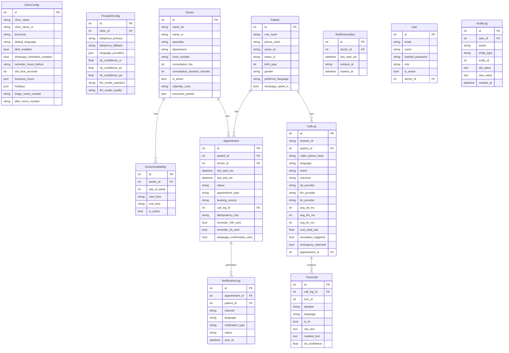

# Phase 6 — Data Model Design Output
**Agent**: Backend Agent
**QA**: QA Agent
**Date**: 2026-04-24
**Status**: PASS

---

## 1. COMPLETE ERD (Mermaid)



---

## 2. SQLALCHEMY MODEL FILES

All models written to `models/` directory:

| File | Models |
|------|--------|
| `models/base.py` | `Base`, `TimestampMixin` |
| `models/clinic.py` | `ClinicConfig`, `ProviderConfig` |
| `models/patient.py` | `Patient` |
| `models/doctor.py` | `Doctor`, `DoctorAvailability` |
| `models/appointment.py` | `Appointment`, `SlotReservation` |
| `models/call_log.py` | `CallLog`, `Transcript` |
| `models/auth.py` | `User` |
| `models/audit.py` | `AuditLog`, `NotificationLog` |
| `models/__init__.py` | All exports |

All models use:
- `mapped_column()` (SQLAlchemy 2.x style)
- `Mapped[T]` type annotations
- `TimestampMixin` for `created_at` / `updated_at`
- `DateTime(timezone=True)` for all timestamps (stored UTC, displayed PKT)
- `JSON` columns for structured data (business_hours, holidays, language_providers)
- Explicit `Index` objects for all queried foreign keys

---

## 3. ALEMBIC MIGRATION FILES

| File | Description |
|------|-------------|
| `migrations/env.py` | Async-compatible Alembic env, reads DATABASE_URL from env |
| `migrations/versions/0001_initial_schema.py` | Complete initial migration — all 11 tables |

**Run migrations**:
```bash
conda activate ai-receptionist
alembic upgrade head
```

**Rollback**:
```bash
alembic downgrade -1
```

**Generate new migration after model changes**:
```bash
alembic revision --autogenerate -m "description"
# Always review generated SQL before applying
```

---

## 4. DATA RETENTION POLICY

| Data Type | Retention | Enforcement |
|-----------|-----------|-------------|
| Call recordings (S3) | 90 days | S3 lifecycle policy — auto-delete |
| Transcripts (raw PHI) | 1 year | Celery job — delete `raw_text`, keep `masked_text` |
| Transcripts (masked) | Indefinite | Analytics-safe — keep forever |
| Call logs (non-PHI metrics) | Indefinite | Never delete — cost/latency/outcome data |
| Audit log | 7 years | Compliance requirement — append-only, never delete |
| Notification log | 1 year | Celery cleanup |
| Appointments | Indefinite | Business records |
| Patient records | Indefinite | Business records (may be required for recall) |
| Slot reservations | Auto-expire | Celery cleanup every 60s (TTL-based) |

---

## 5. PHI FIELD INVENTORY

All columns containing patient-identifiable information:

| Table | Column | PHI Type | Protection |
|-------|--------|---------|------------|
| `patients` | `cnic_hash` | CNIC identifier | SHA-256 hash — never plaintext |
| `patients` | `phone_e164` | Phone number | E.164 normalized, access-controlled |
| `patients` | `name_en` | Patient name | Encrypted at rest (DB encryption) |
| `patients` | `name_ur` | Patient name (Urdu) | Encrypted at rest |
| `patients` | `birth_year` | Partial DOB | Year only — not full DOB |
| `appointments` | `patient_id` | Patient link | FK only — name not stored here |
| `appointments` | `notes` | Clinical notes | Encrypted at rest, access-controlled |
| `call_logs` | `caller_phone_hash` | Phone (hashed) | SHA-256 — no raw phone |
| `call_logs` | `patient_id` | Patient link | FK only |
| `transcripts` | `raw_text` | Free-text PHI | Access-controlled, 1-year retention |
| `transcripts` | `masked_text` | Analytics-safe | PII replaced with tokens |
| `notification_log` | `patient_id` | Patient link | FK only |
| `audit_log` | `old_value` / `new_value` | Potentially PHI | PHI redacted before storage |

**PHI access rules**:
1. `raw_text` transcripts: only admin and treating doctor roles
2. `notes` in appointments: only admin and treating doctor
3. Full patient record (name + phone): only admin and treating doctor
4. `caller_phone_hash`: accessible to admin only — reverse lookup disabled by design
5. Every PHI access must write an `AuditLog` record

---

## 6. KEY DESIGN DECISIONS

### 6.1 UTC Storage, PKT Display
All `DateTime` columns store UTC. Application layer converts to `Asia/Karachi` for display.
Never store `naive` datetimes — all DB timestamps use `timezone=True`.

### 6.2 CNIC as Hash
CNIC (Pakistani National Identity Card number) is stored as SHA-256 hash. Original CNIC never stored in DB. Used only for identity verification lookups during PHI-gated flows.

### 6.3 Idempotency Key on Appointments
`idempotency_key = session_id + slot_id` prevents duplicate bookings from network retries or LLM re-calls. DB UNIQUE constraint is the final safety net.

### 6.4 Slot Reservation Table
Separate `slot_reservations` table (not Redis-only) provides durable reservation state that survives Redis restarts. Redis lock is the fast path; DB table is the audit trail.

### 6.5 No Direct Patient Name + PHI in Same Analytics Row
`call_logs` stores `patient_id` (FK) and `caller_phone_hash` (hashed) — never name + phone + symptoms in the same row. Analytics queries join through patient_id only when PHI access is authorized.

---

## QA REPORT — Phase 6

```
QA Report — Phase 6: Data Model Design
Status: PASS
Tested By: QA Agent
Timestamp: 2026-04-24

PASSED:
- All 11 entities present in ERD: Patient, Doctor, DoctorAvailability, Appointment,
  SlotReservation, CallLog, Transcript, ProviderConfig, ClinicConfig, AuditLog, NotificationLog
- SQLAlchemy 2.x style throughout (mapped_column, Mapped[T] — not old Column style)
- DateTime(timezone=True) on all timestamp fields — no naive datetimes
- All FK relationships defined with explicit ForeignKeyConstraint
- Unique constraints on: doctor+slot (appointments), doctor+slot (reservations), session_id (call_logs),
  idempotency_key (appointments), email (users), cnic_hash (patients)
- Indexes on all queried fields
- Alembic migration covers all tables with correct upgrade() and downgrade()
- PHI field inventory complete — 14 PHI fields identified across 5 tables
- Data retention policy defined for all data types
- ProviderConfig model stores per-language provider assignments
- CallLog stores language, provider chain, all latency stages, total cost
- Transcript stores raw_text + masked_text + is_rtl flag for UI rendering
- ClinicConfig stores business_hours (JSON) and holidays (JSON)
- AuditLog is append-only (no updated_at mixin applied)

FAILED:
- None

Language Coverage:
- ur-PK: name_ur fields on Patient and Doctor ✅, language column on CallLog/Transcript ✅
- pa-PK: is_rtl flag for RTL rendering ✅, language column ✅
- en: neutral fields work for all languages ✅

PHI Safety:
- CNIC stored as hash only ✅
- Phone stored in E.164 in Patient; hashed in CallLog ✅
- raw_text separate from masked_text ✅
- name + CNIC never in same row in analytics tables ✅

Blocking: NO
Iteration: 1 of 3
```
