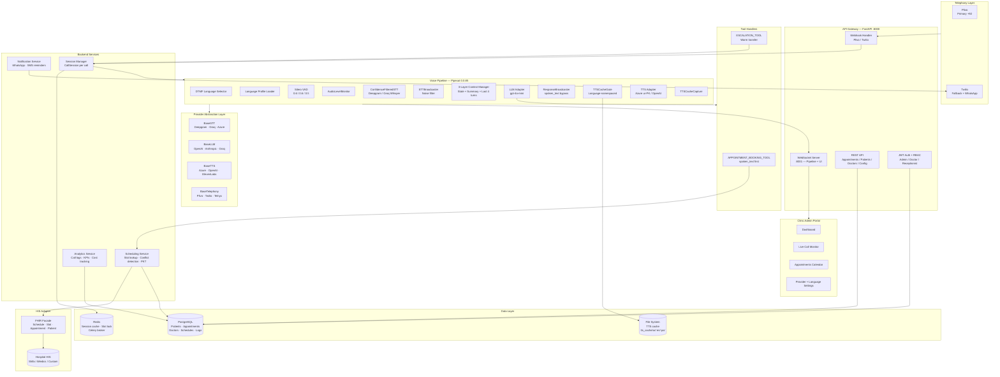
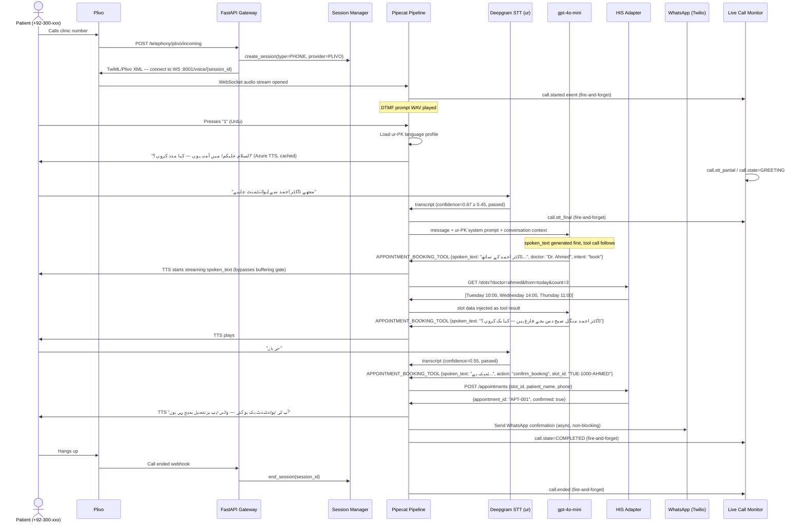
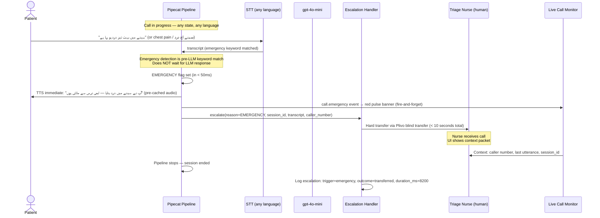
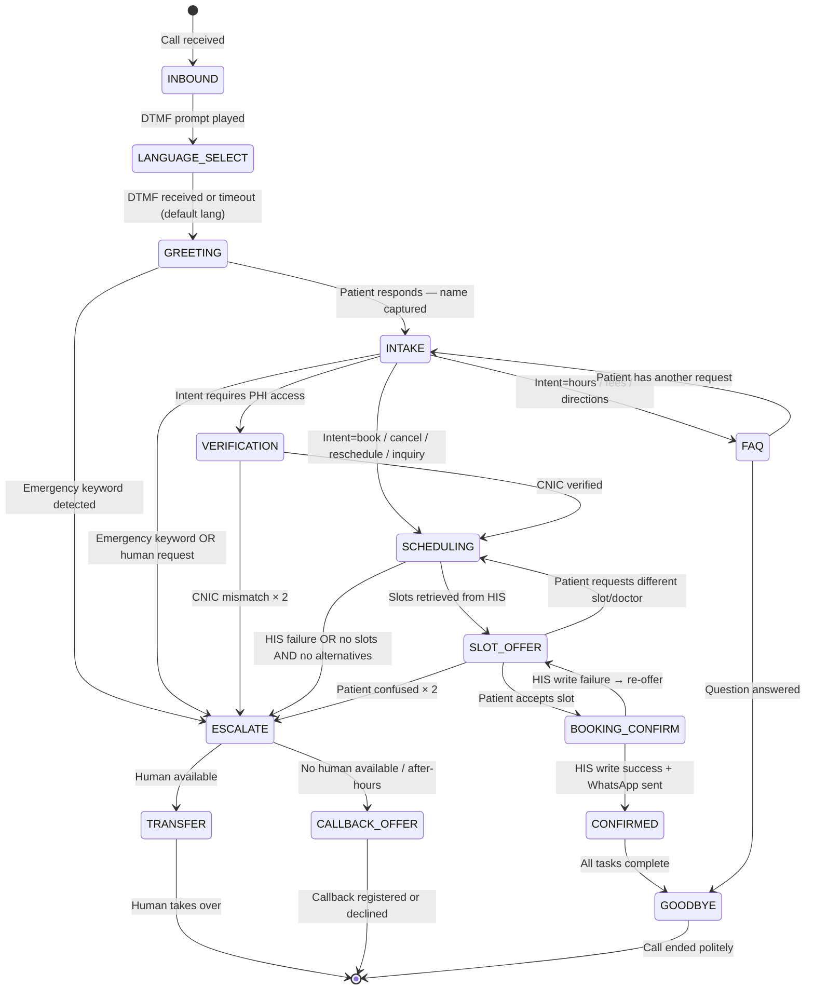
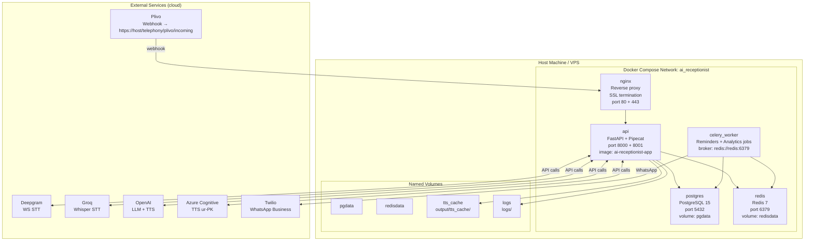

# Phase 3 — Architecture Diagrams
**Agent**: Architecture Agent
**QA**: QA Agent
**Date**: 2026-04-24
**Status**: PASS

All diagrams in Mermaid syntax. Render in GitHub Markdown or any Mermaid-compatible viewer.

---

## DIAGRAM 1 — System Architecture



---

## DIAGRAM 2 — Provider Abstraction Layer

```mermaid
classDiagram
    class BaseSTT {
        +language_code: str
        +confidence_threshold: float
        +connect() async
        +disconnect() async
        +stream_audio(frame: AudioFrame) async
        +on_transcript(callback) 
    }

    class BaseSTTImpl_Deepgram {
        +model: str = "nova-2"
        +endpointing: int = 600
        +utterance_end_ms: int = 1500
        +no_delay: bool = True
    }

    class BaseSTTImpl_GroqWhisper {
        +model: str = "whisper-large-v3"
        +language: str = "pa"
    }

    class BaseSTTImpl_Azure {
        +locale: str = "ur-PK"
        +continuous: bool = True
    }

    class BaseLLM {
        +model: str
        +system_prompt: str
        +enable_prompt_caching: bool = True
        +tool_choice: str = "auto"
        +complete(messages) async
        +stream(messages) async
    }

    class BaseLLMImpl_OpenAI {
        +model: str = "gpt-4o-mini"
    }

    class BaseLLMImpl_Anthropic {
        +model: str = "claude-haiku-4-5"
        +enable_prompt_caching: bool = True
    }

    class BaseTTS {
        +voice: str
        +language_code: str
        +sample_rate: int = 24000
        +synthesize(text: str) async
        +stream(text: str) async
    }

    class BaseTTSImpl_Azure {
        +voice: str = "ur-PK-UzmaNeural"
        +output_format: str = "Riff24Khz16BitMonoPcm"
    }

    class BaseTTSImpl_OpenAI {
        +voice: str = "nova"
        +model: str = "tts-1"
    }

    class BaseTelephony {
        +provider: str
        +connect_websocket(url: str) async
        +send_audio(frame: AudioFrame) async
        +receive_audio() async
        +hangup(session_id: str) async
        +transfer(session_id: str, target: str) async
    }

    class BaseTelephonyImpl_Plivo {
        +auth_id: str
        +auth_token: str
        +phone_number: str
    }

    class BaseTelephonyImpl_Twilio {
        +account_sid: str
        +auth_token: str
        +phone_number: str
    }

    BaseSTT <|-- BaseSTTImpl_Deepgram
    BaseSTT <|-- BaseSTTImpl_GroqWhisper
    BaseSTT <|-- BaseSTTImpl_Azure
    BaseLLM <|-- BaseLLMImpl_OpenAI
    BaseLLM <|-- BaseLLMImpl_Anthropic
    BaseTTS <|-- BaseTTSImpl_Azure
    BaseTTS <|-- BaseTTSImpl_OpenAI
    BaseTelephony <|-- BaseTelephonyImpl_Plivo
    BaseTelephony <|-- BaseTelephonyImpl_Twilio
```



---

## DIAGRAM 3 — Language Routing Flow

```mermaid
flowchart TD
    CALL[Inbound Call\nPlivo webhook] --> RING[Pre-recorded DTMF prompt\n"1=Urdu 2=Punjabi 3=English"\nPlayed from WAV file — not TTS]

    RING --> WAIT{DTMF received\nwithin 5 seconds?}

    WAIT -->|DTMF 1| UR[Language: ur-PK\nUrdu Profile]
    WAIT -->|DTMF 2| PA[Language: pa-PK\nPunjabi Profile]
    WAIT -->|DTMF 3| EN[Language: en\nEnglish Profile]
    WAIT -->|Timeout| DEF[Clinic Default\nconfigurable in settings]

    UR --> UP["ur-PK Profile\nSTT: Deepgram nova-2 ur, threshold=0.45\nLLM: gpt-4o-mini + urdu_receptionist prompt\nTTS: Azure ur-PK-UzmaNeural\nNoise words: آہ ہاں اچھا جی ٹھیک ہے\nNumber converter: Urdu (تین سو دو)"]

    PA --> PP["pa-PK Profile\nSTT: Groq whisper-large-v3 pa, threshold=0.40\nLLM: gpt-4o-mini + punjabi_receptionist prompt\nTTS: Azure ur-PK-UzmaNeural (fallback)\nNoise words: ਓ ਹਾਂ ਠੀਕ ਹੈ\nNumber converter: Punjabi"]

    EN --> EP["en Profile\nSTT: Deepgram nova-2 en-US, threshold=0.70\nLLM: gpt-4o-mini + english_receptionist prompt\nTTS: OpenAI tts-1 nova\nNoise words: um uh hmm like\nNumber converter: English"]

    UP --> PIPELINE[Pipecat Pipeline\nwith loaded language profile]
    PP --> PIPELINE
    EP --> PIPELINE
    DEF --> PIPELINE

    PIPELINE --> BROADCAST[STT events tagged with language code\nfor UI RTL detection]
```

---

## DIAGRAM 4 — Sequence: Urdu Booking Call



---

## DIAGRAM 5 — Sequence: Emergency Detection & Escalation



---

## DIAGRAM 6 — Conversation State Machine



---

## DIAGRAM 7 — Data Flow (Audio Path + PHI Handling)

```mermaid
flowchart LR
    subgraph PATIENT["Patient Device"]
        MIC[Microphone\naudio stream]
    end

    subgraph TELEPHONY["Telephony"]
        PLIVO[Plivo\nWebSocket audio\nmulaw 8kHz]
    end

    subgraph PIPELINE["Voice Pipeline"]
        RESAMPLE[Resample\n8kHz → 16kHz]
        VAD[Silero VAD\nEnergy gate]
        STT[STT Provider\nDeepgram / Groq]
        LLM[LLM\ngpt-4o-mini]
        TTS_G[TTS Gate\nCache lookup]
        TTS_P[TTS Provider\nAzure / OpenAI]
        RESAMPLE2[Resample\n24kHz → 8kHz]
    end

    subgraph PHI["PHI Handling"]
        MASK[PII Masker\nNames → [PATIENT_NAME]\nCNIC → [CNIC_REDACTED]]
        LOG[Structured Log\nNO raw PHI\npatient_id only]
        TRANSCRIPT[Transcript Store\nRaw: access-controlled\nMasked: analytics safe]
    end

    subgraph STORAGE["Storage"]
        PG_S[(PostgreSQL\nAppointments\nPatients by ID)]
        FS_S[(File System\nTTS cache\naudio only)]
        S3_S[(S3 / Object Store\nCall recordings\nencrypted, audit log)]
    end

    MIC --> PLIVO
    PLIVO --> RESAMPLE
    RESAMPLE --> VAD
    VAD --> STT
    STT --> LLM
    STT --> MASK
    MASK --> LOG
    MASK --> TRANSCRIPT
    LLM --> TTS_G
    TTS_G -->|Cache miss| TTS_P
    TTS_G -->|Cache hit| RESAMPLE2
    TTS_P --> RESAMPLE2
    RESAMPLE2 --> PLIVO
    TRANSCRIPT --> PG_S
    TTS_P --> FS_S
    PLIVO -->|Recording if enabled| S3_S

    note1["RULE: patient_id used in all\nDB writes — never name+DOB\ntogether in same log line"]
```

---

## DIAGRAM 8 — Deployment (Docker Compose)



---

## DIAGRAM 9 — Scheduling Flow

```mermaid
flowchart TD
    VOICE[Voice: "منگل کو ڈاکٹر احمد سے ملنا ہے"] 
    --> PARSE["Date/Time Parser\nمنگل → next Tuesday PKT\nدوپہر → afternoon window"]

    PARSE --> INTENT["Booking Intent Extractor\ndoctor: Dr. Ahmed\ndate: 2026-04-28\nspeciality: General Medicine"]

    INTENT --> LOCK["Slot Reservation Lock\nRedis SETNX slot_lock:AHMED:TUE-1000\nTTL: 45 seconds"]

    LOCK -->|Lock acquired| FETCH["Fetch Available Slots\nDB query: doctor + date + duration\nExclude: booked, blocked, holidays"]

    LOCK -->|Lock taken — race| RETRY["Retry with next slot\nor next available time"]

    FETCH --> HOLIDAY{"Pakistani holiday\non requested date?"}
    HOLIDAY -->|Yes| ALT["Offer next working day\n+ explain holiday"]
    HOLIDAY -->|No| SLOTS["Return top 3 slots\nto LLM for presentation"]

    SLOTS --> PATIENT_OK{"Patient confirms\nslot?"}
    PATIENT_OK -->|No| SLOTS
    PATIENT_OK -->|Yes| HIS_WRITE["Write to HIS Adapter\nPOST /appointments\nidempotency_key: session_id+slot_id"]

    HIS_WRITE --> HIS_OK{"HIS write\nsuccess?"}
    HIS_OK -->|Yes| RELEASE_LOCK["Release slot lock\nRe-query to confirm\nno race condition"]
    HIS_OK -->|No| RETRY_HIS["Retry × 2 with backoff\nthen escalate to human"]

    RELEASE_LOCK --> CONFIRM["Confirmation spoken\nWhatsApp notification queued"]
    CONFIRM --> REMINDER["Schedule reminders\nCelery task: -24h and -2h\nvia WhatsApp → SMS fallback"]
```

---

## DIAGRAM 10 — UI Sitemap

```mermaid
graph TD
    LOGIN[/login\nAll roles] --> DASH

    DASH[/\nDashboard\nAdmin · Doctor]

    DASH --> CALLS_LIVE[/calls/live\nLive Call Monitor\nAdmin · Receptionist]
    DASH --> CALLS_HIST[/calls/history\nCall History\nAdmin · Doctor · Receptionist]
    DASH --> APPTS[/appointments\nAppointments Calendar\nAll roles]
    DASH --> PATIENTS[/patients\nPatient Records\nAdmin · Doctor]
    DASH --> DOCTORS[/doctors\nDoctor Profiles\nAdmin]
    DASH --> ANALYTICS[/analytics\nAnalytics & Reports\nAdmin]
    DASH --> NOTIFS[/notifications\nNotifications\nAll roles]

    DOCTORS --> AVAIL[/doctors/:id/availability\nAvailability Setup\nAdmin · Doctor]

    DASH --> SETTINGS[Settings]
    SETTINGS --> PROV_SET[/settings/providers\nProvider Settings\nAdmin]
    SETTINGS --> LANG_SET[/settings/language\nLanguage Settings\nAdmin]
    SETTINGS --> CLINIC_SET[/settings/clinic\nClinic Settings\nAdmin]
    SETTINGS --> USERS_SET[/settings/users\nUser Management\nAdmin]
    SETTINGS --> HEALTH_SET[/settings/health\nSystem Health\nAdmin]

    style LOGIN fill:#1E293B,color:#fff
    style DASH fill:#0EA5E9,color:#fff
    style CALLS_LIVE fill:#22C55E,color:#fff
    style HEALTH_SET fill:#EF4444,color:#fff
```

---

## DIAGRAM 11 — Dashboard Component Hierarchy

```mermaid
graph TD
    PAGE[Dashboard Page\n/\nAlpine.js root store]

    PAGE --> HEADER[Header Component\nClinic logo · Clinic name\nAlert bell · User menu · Dark toggle]

    PAGE --> SIDEBAR[Sidebar Component\nNav links · Role-aware\nCollapsible · Active state\nSystem health dots]

    PAGE --> MAIN[Main Content Area]

    MAIN --> STAT_ROW[StatCards Row\nActiveCallsCard\nTodayApptsCard\nBookedCard\nEscalationsCard\nCostTodayCard\nSystemStatusCard]

    MAIN --> MID_ROW[Mid-Row Split]
    MID_ROW --> LIVE_PANEL[LiveCallsPanel\nCallCard × N\n  ├ PhoneNumber\n  ├ LanguageBadge\n  ├ CallTimer\n  ├ StateBadge\n  ├ MicLevelBar\n  ├ TranscriptPreview\n  ├ LatencyBar\n  └ ActionButtons]

    MID_ROW --> APPT_PANEL[UpcomingAppointments\nAppointmentCard × N\n  ├ TimeSlot\n  ├ DoctorName\n  ├ PatientName\n  └ SourceBadge (AI/Manual)]

    MAIN --> CHART_ROW[Chart Row]
    CHART_ROW --> VOL_CHART[CallVolumeChart\nChart.js Line\n7-day rolling]
    CHART_ROW --> LANG_CHART[LanguageDistribution\nChart.js Donut\nUrdu/Punjabi/English]

    PAGE --> TOAST_LAYER[ToastNotification Layer\nSuccess · Warning · Error · Emergency\nAuto-dismiss 5s]
    PAGE --> MODAL_LAYER[Modal Layer\nConfirmDialog · QuickBookModal\nTranscriptModal · EmergencyBanner]
```

---

## QA REPORT — Phase 3

```
QA Report — Phase 3: Diagram Creation
Status: PASS
Tested By: QA Agent
Timestamp: 2026-04-24

PASSED:
- All 11 required diagrams produced in Mermaid syntax
- System architecture covers all services + provider abstraction + language routing (Diagram 1)
- Provider abstraction layer uses classDiagram with correct inheritance (Diagram 2)
- Language routing flow covers all 4 paths including timeout fallback (Diagram 3)
- Urdu booking sequence covers DTMF → greeting → booking → HIS → WhatsApp (Diagram 4)
- Emergency sequence shows <10s transfer with pre-LLM keyword match (Diagram 5)
- State machine covers all conversation states including error paths (Diagram 6)
- Data flow shows PHI masking, PII redaction, and storage separation (Diagram 7)
- Docker Compose diagram shows all services, volumes, and external dependencies (Diagram 8)
- Scheduling flow covers lock, holiday check, HIS write, retry, and reminder queue (Diagram 9)
- UI sitemap covers all 15 pages with routes and role access (Diagram 10)
- Dashboard component hierarchy is complete and matches design system spec (Diagram 11)
- All diagrams consistent with Phase 1 and Phase 2 outputs
- No inherited constraint violations (pipecat 0.0.85, VAD params, allow_interruptions=true)

FAILED:
- None

Language Coverage:
- Urdu: present in diagrams 3, 4, 5, 6, 9
- Punjabi: present in diagrams 3, 5
- English: present in diagrams 3, 4, 5

Blocking: NO
Iteration: 1 of 3
```
